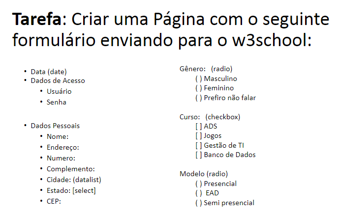
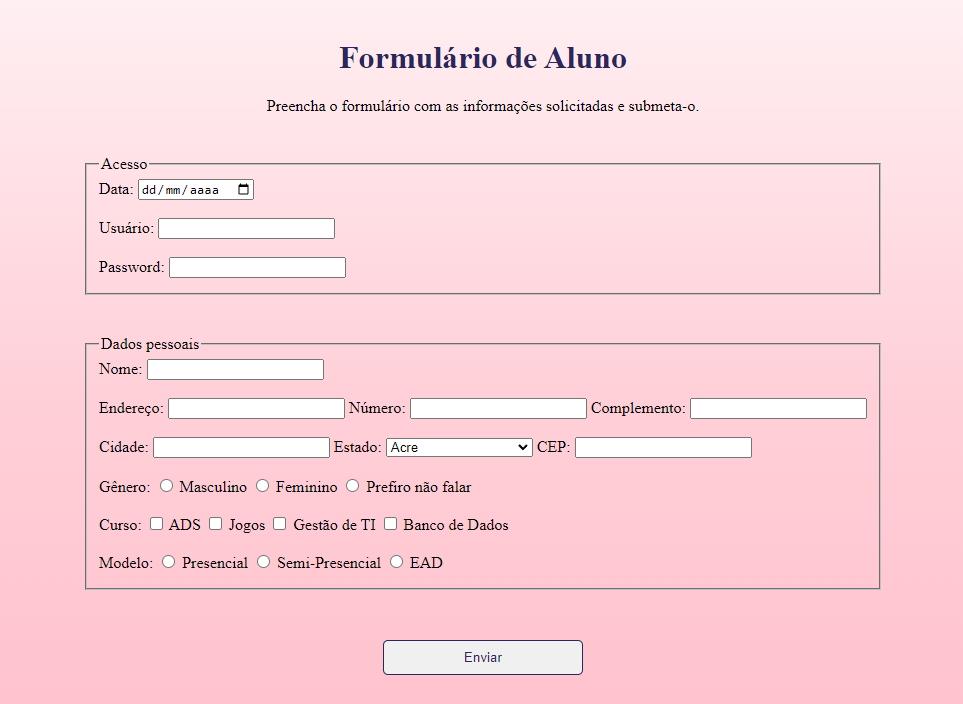

# Formulário Simples
Formulário simples em HTML. Atividade realizada para a disciplina de Linguagens de Programação do terceiro semestre em Análise e Desenvolvimento de Sistemas, na qual estamos trabalhando com linguagens e frameworks front-end. Consiste no desenvolvimento de um formulário simples endereçado no GithubPages e com direcionamento à página [W3Schools](https://www.w3schools.com/action_page.php).

## Exercício proposto 
 

## Solução
 

Solução disponível neste [link](https://mari4souza.github.io/ldp-simple-form/).
